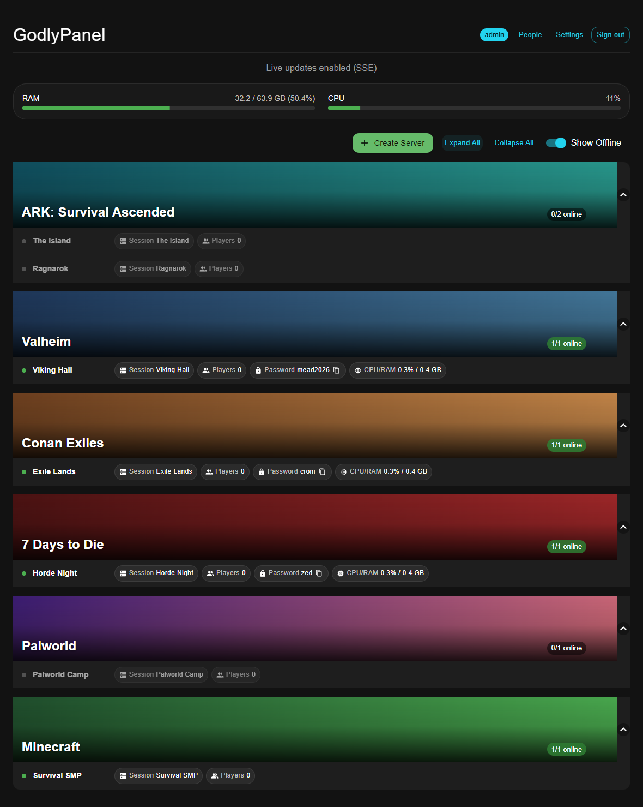
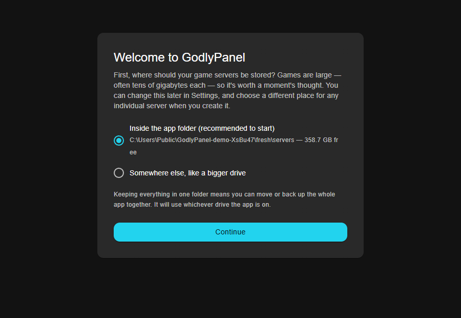
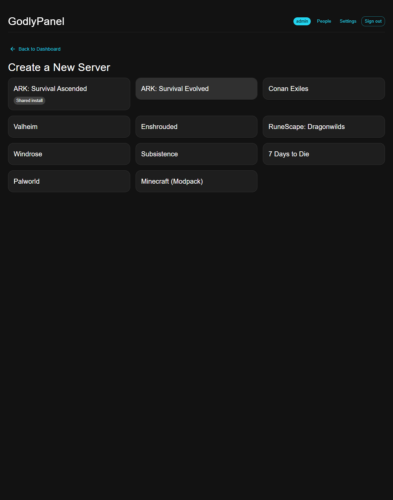
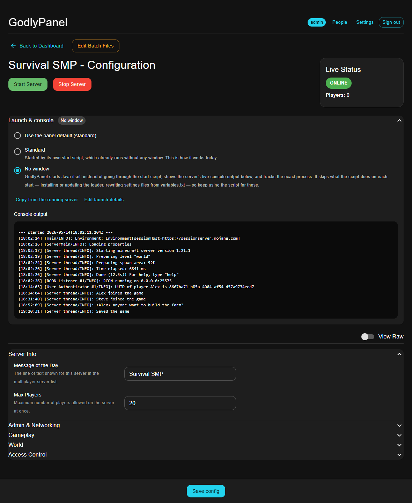
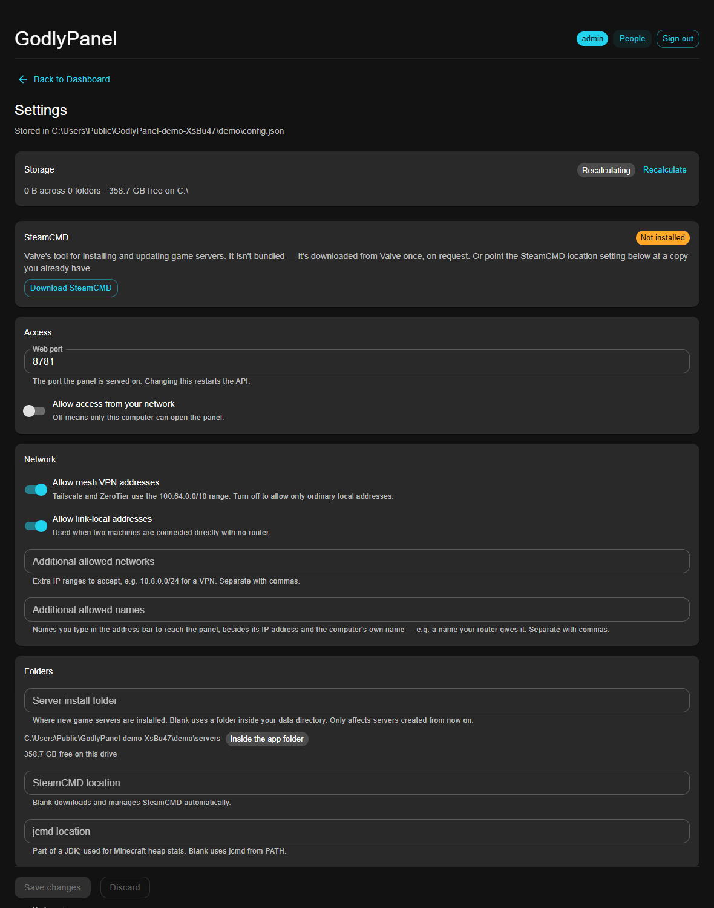

# GodlyPanel

**An all-in-one control panel for running game servers on a Windows PC.** Download a
zip, unpack it, run `GodlyPanel.exe`. There's no separate website to host, no tunnel,
no database to install, and no command line. Everything it needs, including its own
web server and its own data, lives in that one folder.

Create servers from templates, start and stop them, watch their status, edit their
config files, keep them updated, and give the people in your community a read-only
view of what's running.



> **Status: early (v0.1).** It runs a real community's servers day to day, but it has
> been tried on one PC, has no releases yet, and there will be rough edges. See
> [Known limitations](#known-limitations) before you trust it with anything you can't
> afford to redo.

---

## How this was built (please read this)

I'll be straightforward about it, because you're being asked to run this on your
computer and trust it with your game servers:

- **This app is built with [Claude Code](https://www.anthropic.com/claude-code),**
  Anthropic's AI coding agent. Nearly all of the code was written by Claude, working
  with me in a terminal session.
- **I'm one developer,** running a community's game servers as a hobby, on a **Claude
  Pro plan**. There's no team, no company, and no budget. I direct the work, decide
  what it should do, run it against my own servers, and review what comes back.
- **The code has not had an independent security audit.** It has an extensive
  automated test suite (over 130 tests, described [below](#tests)), and the design
  choices are written down in [SECURITY.md](SECURITY.md), but that isn't the same as
  a professional review. The threat model is a trusted home or community network, not
  the internet.
- **It is improving in every direction as I go:** performance, security, and features.
  Recent work has included an audit pass over the whole app (hardening login, closing
  a DNS-rebinding hole, cutting the app's background process launches, shrinking the
  package by 25 MB), new ways of running servers with no taskbar clutter, and fixes
  for bugs found by testing against real game servers. The commit history is the
  honest record of what changed and why.

If AI-written software isn't something you're comfortable running, that's a perfectly
reasonable position. If it is, I've tried to make the code, the tests, and the
reasoning behind each decision easy to check for yourself: comments explain *why*, and
commit messages describe the problem each change solved.

---

## What it does

- **Creates game servers for you.** Pick a game, name it, choose ports (it suggests free
  ones), and the panel downloads the server with SteamCMD, writes a working start
  script and config, and registers it. No editing batch files by hand.
- **Monitors them live.** Online/offline, player counts, ping, CPU and RAM per server,
  and JVM heap use for Minecraft, updated live as things change.
- **Starts, stops and updates them.** Graceful stops (saving the world first where the
  game supports it), one-click updates through SteamCMD, an RCON console where a game
  has one, and optional automatic updates with an in-game countdown.
- **Edits config files** through a form when it knows the format, or as raw text,
  keeping a `.bak` of whatever it replaces.
- **Shares a read-only view** with your community through a real guest account. Guests
  see what's running and how to join; they can't see passwords or change anything.
- **Runs servers without cluttering your taskbar.** Each server can be minimized, hidden,
  or launched with no window at all, with its live console output shown in the panel.
- **Manages storage.** Choose where servers are installed (the drive matters: games are
  big), see how much they use, and optionally set a limit.
- **Posts to Discord** (optional): one status message that updates in place, plus
  update announcements.
- **Imports an existing setup** instead of starting over.

### Supported games

| Game | Notes |
|---|---|
| ARK: Survival Ascended | Several maps share one install; RCON console and graceful save-and-stop |
| ARK: Survival Evolved | Own install per server; mods supported |
| Conan Exiles | RCON console and stop (see the note in [Known limitations](#known-limitations)) |
| Valheim | |
| Enshrouded | |
| RuneScape: Dragonwilds | |
| Windrose | |
| Subsistence | |
| 7 Days to Die | Saves over Telnet before stopping |
| Palworld | |
| **Minecraft (modded)** | Upload a CurseForge modpack's *server* export; NeoForge, Forge and Fabric. Needs a free [CurseForge API key](https://console.curseforge.com/) for downloading mods |

Other games can still be **imported and managed**: monitoring, start/stop, and file
editing work for anything with a start script, even without a creation template.

---

## Screenshots

| | |
|---|---|
|  |  |
| **First run.** Choose where servers live, then create your admin account. | **Create a server** from a template. |
|  |  |
| **A server's page:** config editor, window/launch settings, live console output. | **Settings:** every setting is editable here, validated, and marked if it needs a restart. |

The colour banners above are the built-in fallback. On first use the panel fetches each
game's artwork from Steam and caches it locally; you can replace any of it with your own
image or a colour in Settings → Appearance.

---

## Install

**Requirements:** Windows 10 or 11 (64-bit). That's all: the zip includes everything
else, and it uses the PowerShell that ships with Windows.

1. Download the latest `GodlyPanel-…-win.zip` from the
   [Releases](../../releases) page.
2. **Unzip it somewhere with plenty of free space,** for example `D:\GodlyPanel`. By
   default, servers you create are stored inside this folder (you can choose another
   drive on first run). Avoid `C:\Program Files`, which is write-protected.
3. Run **`GodlyPanel.exe`**.
4. Windows may say *"Windows protected your PC"*, because the app isn't code-signed
   (that costs money I don't have). Choose **More info → Run anyway**. If you'd rather
   not, [build it from source](#development) yourself.
5. Follow the first-run screen: pick where servers will be stored, then create the
   admin account.

The window is just a viewer. Closing it leaves the panel running in the system tray, so
monitoring and scheduled jobs carry on; use the tray icon's **Quit** to exit.
**Your game servers keep running either way**: they are independent processes and
don't depend on the panel staying open.

### Letting people on your network see it

The panel listens on port **8765** and only accepts connections from your local network.
Other machines on it can open `http://<this-pc's-ip>:8765` and sign in with a guest
account you create under **People**. The panel prints its network address in its log,
and the tray icon menu shows its state.

There is **no port forwarding** and no tunnelling in v1, by design: routers differ too
much, and exposing an admin tool to the internet isn't something to do casually.
Forwarding *game* ports so friends can join is a normal router setup, the same as for
any game server, and is up to you.

---

## Where your data lives

Everything is in the `data` folder next to the app, so moving or backing up the folder
moves or backs up everything.

| Path | Contents |
|---|---|
| `config.json` | Your settings. Safe to paste into a support thread. |
| `secrets.json` | Login signing key, Discord webhooks, CurseForge key. **Never share this.** |
| `users.json` | Accounts (passwords are bcrypt hashes). |
| `servers.json` | The servers the panel manages. |
| `servers\` | Servers created by the panel (unless you chose another folder). |
| `tools\steamcmd\` | SteamCMD, downloaded on request. |
| `logs\` | The panel's log (rotated), and captured output of servers it launched itself. |
| `cache\`, `art\` | Downloaded and uploaded artwork. |

Delete `data` and you have a fresh install. Everything the panel itself stores lives
there, and its file editing is confined to the server folders you tell it about.

---

## Running servers without taskbar clutter

Most game server scripts launch the game with `start /MIN`, which puts a console on your
taskbar for every server. Each server can instead be run in one of three modes, chosen
per server and changeable at any time, even while it's running:

| Mode | What happens |
|---|---|
| **Minimized** | The old behaviour: a minimized window on the taskbar. Best when you want to watch the console yourself. |
| **Hidden** *(default)* | Same launch, but the window is hidden the moment it appears and kept hidden while the game finishes starting (several games open a log window late). Works with any start script. |
| **No window** | The panel starts the game program itself, so no window exists at all, and shows the server's live console output in the panel. |

"No window" needs the program, its arguments and its folder. The panel can read them
out of most start scripts, can copy them from a **running** server (which is how it
handles Minecraft's installer chain and scripts too tangled to read), or you can type
them in. Two things to know: it **skips whatever else your script does** (for example
a SteamCMD update check before launching; use the panel's own Update or auto-update
instead), and it has so far only been verified against stand-in programs and a
handful of real games, so treat it as new.

---

## Security model, in short

It's built for a **trusted home or community network**. Full details in
[SECURITY.md](SECURITY.md); the short version:

- Accepts connections **only from local-network addresses**, and only for the
  computer's IP address, `localhost`, or its own name (which blocks DNS-rebinding).
- **Two roles, enforced on the server:** *admin* and *guest*. Guests can't see join
  passwords, config files, or anything that changes state.
- bcrypt password hashing, rate-limited sign-in, timing-safe username checks,
  HttpOnly + SameSite=Strict session cookies, and sessions that end immediately when a
  password or role changes.
- Config and file access is confined to the server folders the panel manages; nothing
  from a config file is ever passed through a shell.
- It is served over **plain HTTP**. On a network you trust that's fine; on one you
  don't, someone could read your session cookie. Don't run it on a hostile network.

An admin can run programs on the PC (they can already do that by editing a server's
start script), so only give admin to people you'd let use your computer.

---

## Known limitations

Honest list, roughly by how likely you are to hit them:

- **Windows only, and tried on one PC.** Everything so far has run on the developer's
  own Windows 11 machine. A clean-machine test is next. Reports from other setups are
  very welcome.
- **The app isn't code-signed,** so Windows SmartScreen warns on first run.
- **"No window" mode** hasn't been verified for every game. Unreal-engine games may
  still open their own log window in that mode; if so, use Hidden.
- **Two servers running the same program** (for example two Valheim servers) can't be
  told apart for window hiding, because the panel identifies a server's windows by its
  program name. ARK servers are distinguished by their RCON port.
- **Conan Exiles takes a minute or more to exit** after Stop, because it saves and
  shuts down. The panel shows it online until it has actually gone.
- **Game artwork comes from Steam's CDN** the first time it's needed, so a brand-new
  install with no internet shows plain colour banners.
- **Minecraft mods need a CurseForge API key,** and modpacks must be the *server*
  export.
- **There are no built-in backups yet,** and no automatic restart-after-crash or
  start-with-Windows. These are next on the list.
- **v0.x means things will change.** Settings and data formats are versioned and
  migrated, but back up your `data` folder before upgrading.

---

## Development

You need Windows 10/11 and [Node.js](https://nodejs.org/) 22 or newer.

```powershell
git clone https://github.com/Vulcanie/GodlyPanel.git
cd GodlyPanel
npm run setup        # installs dependencies for the app and the interface
npm run dev          # builds the interface and opens the app
```

To work on the interface with hot reload, start the panel (`npm run dev`, or the
packaged app) and run `npm run dev:ui`; it proxies API calls to port 8765.

```powershell
npm run package      # produces dist\GodlyPanel-<version>-win.zip
```

### How it fits together

```
  GodlyPanel.exe  (Electron shell: window, tray, supervisor)
        │  forks, restarts on crash, asks it to shut down over IPC
        ▼
  API process     src/server/  (Express; serves the interface AND the API)
        │  same origin → no CORS, cookie sessions work, even for live updates (SSE)
        ├── polling    RCON / query / process checks → live status
        ├── services   creation, updates, windows, storage, artwork, Discord, …
        └── data/      JSON files, written atomically
  Interface       ui/  (React + MUI, built once and served by the API)
```

- **The window is only a browser pointed at the panel's own web server.** That's what
  lets other people on the network use the same interface, and it means there's no
  separate hosted site or API to run.
- **Game servers are launched as independent processes,** so they survive the panel
  quitting or restarting.
- **`src/server/data/gameTemplates.js`** holds what the panel knows about each game.
  Adding a game is mostly a matter of describing its install layout, ports and launch
  line there.
- Data lives in plain JSON with atomic writes and a serialized write queue, chosen over
  a database because a community's worth of servers is a few dozen records.

### Tests

```powershell
npm test               # unit + API tests: about 10 seconds
npm run test:desktop   # real processes and windows: about 2 minutes
npm run test:all       # both
```

- **Unit and API tests** (over 110) boot the real API against a throwaway folder and a
  random port, so they check what a user actually gets, not mocks. They cover accounts
  and sessions, the network filter, polling, file access, uploads, first-run setup, the
  launch-script reader, and a fake Conan Exiles server that reproduces its RCON quirk.
  They run on Windows in CI on every push.
- **Desktop tests** (19) exercise the window modes against stand-in programs and real
  windows, so they need an interactive Windows session and run locally. They only ever
  start and stop programs they created themselves.

Where a bug can be reproduced without a real game server, it gets a test. Some fixes (the ones that only show up against a real game install) don't have one yet, and turning more of them into tests is ongoing work. See [CONTRIBUTING.md](CONTRIBUTING.md).

---

## Roadmap

Roughly in this order:

1. A clean-machine test and a first release.
2. **Backups** of worlds and configs, with restore.
3. **Auto-restart after a crash** and **starting with Windows.**
4. Verifying "No window" mode game by game, and a clearer "stopping…" state.
5. Rotating RCON passwords for imported servers.
6. More games, and whichever needs come up from people actually using it.

---

## Contributing

Bug reports, "this game doesn't work" reports with a working launch line, and testing
on other Windows setups are all welcome. See [CONTRIBUTING.md](CONTRIBUTING.md). Security
issues: [SECURITY.md](SECURITY.md).

## Licence

[MIT](LICENSE) for GodlyPanel's own code. Bundled and downloaded third-party software
has its own terms; see [THIRD_PARTY_NOTICES.md](THIRD_PARTY_NOTICES.md). Game names and
artwork belong to their owners; GodlyPanel isn't affiliated with any of them.
